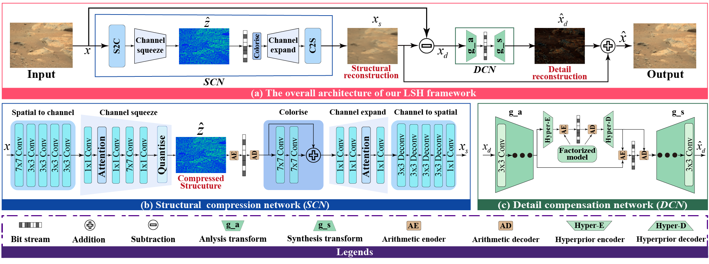
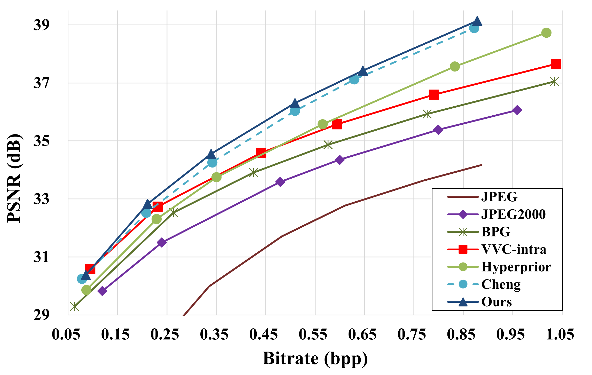

# Official code for Learned Structure-Based Hybrid Framework for Martian Image Compression

https://ieeexplore.ieee.org/document/10296961?source=authoralert

- Network architecture



- RD-performance on the Martain image dataset



## Set up environments

Use the environment.yml file to create the python environment

```sh
conda env create -f environment.yml
pip install -e .
```

## Use the pretrained model

### Download pretrained models
- The pretrained models are available on https://pan.baidu.com/s/1Tov1WCrZnq0qpCz-ofxhWQ?pwd=hh4h with extraction code `hh4h`. We provided both the cheng model and our LSH model. 

- Download the pretrained model in the ckpt directory.

### Datasets

We used the dataset according to the article https://ieeexplore.ieee.org/abstract/document/10008891. The dataset is comming soon on https://github.com/dq0309/MIC-Dataset.

### Examples of using the pretrained models to get the compression results

- Use our LSH model to compress the image, and get the result in the results folder.
```sh
python examples/test.py checkpoint $pathToDataset -a lsh -p ckpt/PSNR/ours/3/checkpoint_best_loss.pth.tar -d results -o lsh_3.json
```

- Use cheng model to compress the image, and get the result in the results folder
```sh
python examples/test.py checkpoint $pathToDataset -a lsh -p ckpt/PSNR/cheng/3/checkpoint_best_loss.pth.tar -d results -o cheng_3.json
```

- The vvc_encoding.py can be used to compress the images with VVC

```sh
python vvc_encoding.py -d $pathToDataset -o $Outdir -q 26 28 30 
```

- The bpg_encoding.py can be used to compress the images with bpg

```sh
python bpg_encoding.py -d $pathToDataset
```

- The jpeg_encoding.py can be used to compress the images with jpeg2000

```sh
python jpeg_encoding.py -d $pathToDataset
```

## Train from scrath

You can train our model with your own dataset with this guide. 

### First train a structure extraction network

```sh
cd get_pretrain_model/A_DSSLIC_simple
python get_pretrain_model/A_DSSLIC_simple/train_finenet_fast.py -d $pathToDataset
```

### Second train our compression model based on the structure extraction network
- Put the weight of the structure extraction network in `pretrain_models` folder or download the pretrained_compnet.pth from the link above and put it to 
the corresponding directory
```sh
mkdir pretrain_models
mv $your_model.pth  pretrain_models/pretrained_compnet.pth
```

- Get the psnr model
```sh
CUDA_VISIBLE_DEVICES=0 python examples/train.py -m model_cheng_anchor_win-attn5 -d $pathToDataset --batch-size 16 -lr 1e-4 --save --cuda --epoch 1000 --patch-size 256 256 --lambda 0.01 --test-batch-size 1
```

- Get the ms-ssim model
```sh
CUDA_VISIBLE_DEVICES=0 python examples/train.py -m model_cheng_anchor_win-attn5 -d $pathToDataset --batch-size 16 -lr 3e-4 --save --cuda --epoch 1000 --patch-size 256 256 --lambda 0.01 --test-batch-size 1 --metric ms_ssim
```

## Citation

```bibtex
@ARTICLE{10296961,
  author={Li, Shengxi and Sun, Xiancheng and Xu, Mai and Jiang, Lai and Zou, Xin},
  journal={IEEE Geoscience and Remote Sensing Letters}, 
  title={Learned Structure-Based Hybrid Framework for Martian Image Compression}, 
  year={2023},
  volume={20},
  number={},
  pages={1-5},
  keywords={Image coding;Image reconstruction;Standards;Transform coding;Image restoration;Convolution;Mars;Deep neural network (DNN);learning-based image compression;Martian image compression (MIC)},
  doi={10.1109/LGRS.2023.3327687}}
```
